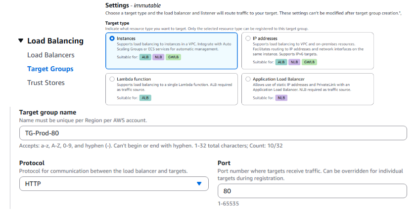
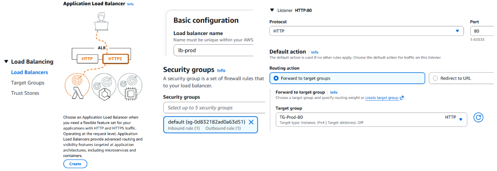

<!-- _class: portada -->

# CS2032 - Cloud Computing

Balanceo de Carga y Alta disponibilidad
Semana 6 - Taller 2: Balanceador de Carga

---

## Contenido

1. Objetivo del taller
2. Ejercicio 1: Crear 2 MV para producción
3. Ejercicio 2: Crear Balanceador de Carga
4. Ejercicio 3: Probar Balanceo de Carga y Alta disponibilidad
5. Cierre

---

<!-- _class: objetivo -->

## Objetivo del taller: Balanceador de Carga

> - Probar Balanceo de Carga y Alta disponibilidad.

---

<!-- _class: seccion -->

## 01

### Ejercicio 1: Crear 2 MV para producción

---

## Ejercicio 1: Crear 2 MV para producción

- **Paso 1**: Crear una máquina virtual ("MV Prod 1") con la AMI `amazon/Cloud9Ubuntu`.
  - Crear grupo de seguridad "GS-Prod" abriendo puertos 22 y 80 (botón Editar).
- **Paso 2**: Crear una segunda máquina virtual ("MV Prod 2").
  - Usar el mismo grupo de seguridad "GS-Prod".
  - Seleccionar una **Zona de Disponibilidad diferente** a la primera MV.

---

<!-- _class: seccion -->

## 02

### Ejercicio 2: Crear Balanceador de Carga

---

## Ejercicio 2: Crear Balanceador de Carga

- **Paso 1:** Crear un Target Group con las 2 máquinas virtuales o instancias para el puerto 80

- **Paso 2:** Crear balanceador de carga

---

## Ejercicio 2: Crear Balanceador de Carga

---

<!-- _class: seccion -->

## 03

### Ejercicio 3: Probar Balanceo de Carga y Alta disponibilidad

---

## Ejercicio 3: Probar Balanceo de Carga y Alta disponibilidad

- **Paso 1:**: Editar la página de inicio de Apache (`/var/www/html/index.html`) en ambas MV para identificar cada una como "Ambiente producción 1" y "Ambiente producción 2".
- **Paso 2:**: Acceder al enlace DNS del balanceador de carga (`lb-prod-...`) repetidamente y observar cómo el tráfico alterna entre ambas MV.

---

## Ejercicio 3: Probar Alta Disponibilidad

Para comprobar la resiliencia del sistema:

- **Paso 3**: Detener la instancia “MV Prod 1” y probar.
- **Paso 4**: Detener la instancia “MV Prod 2” y probar.
- **Paso 5**: Iniciar la instancia “MV Prod 1” y probar.
- **Paso 6**: Iniciar la instancia “MV Prod 2” y probar.

---

<!-- _class: seccion -->

## 04

### Cierre

---

<!-- _class: objetivo -->

## Cierre: ¿Qué aprendimos?

> - Implementación de **Balanceo de Carga** para distribuir tráfico.
> - Verificación de **Alta disponibilidad** ante fallos de instancias.

---

<!-- _class: cierre -->

# ¡Gracias!

---

<!-- _class: cierre -->

