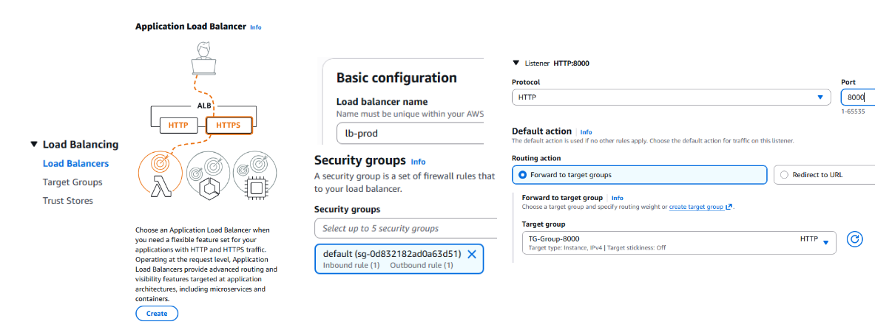
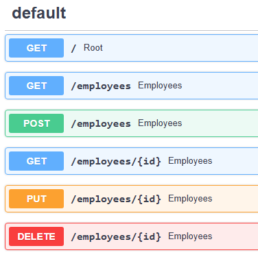
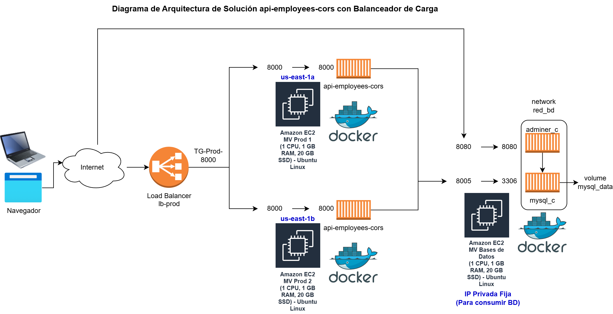

<!-- _class: portada -->

# CS2032 - Cloud Computing

Balanceo de Carga y Alta disponibilidad
Semana 6 - Taller 3: Balanceador de Carga

---

## Contenido

1. Objetivo del taller
2. Ejercicio 1: Crear imagen de api-employees-cors con acceso a BD MySQL en MV desarrollo
3. Ejercicio 2: Desplegar contenedor api-employees en 2 MV de producción
4. Ejercicio 3: Configurar y probar Balanceador de Carga
5. Ejercicio 4: Diagrama de Arquitectura de Solución
6. Cierre

---

<!-- _class: objetivo -->

## Objetivo del taller: Balanceador de Carga

> Probar Balanceo de Carga y Alta disponibilidad con Api REST con acceso a base de datos MySQL

---

<!-- _class: seccion -->

## 01

### Ejercicio 1: Crear imagen de api-employees-cors con acceso a BD MySQL en MV desarrollo

---

## Ejercicio 1: Crear imagen de api-employees-cors con acceso a BD MySQL en MV desarrollo

**Paso 1:** Ingrese a "MV desarrollo" y valide que esté creada la imagen:

```
REPOSITORY             TAG     IMAGE ID      CREATED        SIZE
web-employees          latest  09fe248a9188  44 hours ago   148MB
api-employees-cors     latest  da7f0ab93eb2  45 hours ago   330MB
```

<div class="footer-text">
Referencia del api-employees: <a href="https://techwasti.com/fastapi-mysql-simple-rest-api-example">techwasti.com</a>
</div>

---

## Ejercicio 1: Crear imagen de api-employees con acceso a BD MySQL en MV desarrollo

**Paso 2:** Suba la imagen a [hub.docker.com](https://hub.docker.com)

```bash
docker login -u gcolchado
docker tag api-employees-cors gcolchado/api-employees-cors
docker push gcolchado/api-employees-cors
docker logout
```

> Reemplace `gcolchado` por su usuario de Docker Hub

---

## Ejercicio 1: Crear imagen de api-employees con acceso a BD MySQL en MV desarrollo

**Paso 3:** Ejecute el contenedor de BD MySQL:

Ingrese a la "MV Bases de Datos" y ejecute:

```bash
$ docker run -d --rm --name mysql_c --network red_bd \
  -e MYSQL_ROOT_PASSWORD=utec -p 8005:3306 \
  -v mysql_data:/var/lib/mysql mysql:8.0
```

Ejecute el adminer y valide que exista la tabla:

```bash
docker run -d --rm --name adminer_c --network red_bd -p 8080:8080 adminer
```

> **Importante:** Modifique el Grupo de Seguridad de "MV Bases de Datos" y abra el puerto **8005** al Grupo de Seguridad **"GS-Prod"**

---

<!-- _class: seccion -->

## 02

### Ejercicio 2: Desplegar contenedor api-employees en 2 MV de producción

---

## Ejercicio 2: Desplegar contenedor api-employees en 2 MV de producción

**Paso 1:** Ingrese a las 2 MV de producción y ejecute el contenedor:

```bash
$ docker run -d --rm --name api-employees-cors_c \
  -p 8000:8000 gcolchado/api-employees-cors
```

> Ejecute este comando en **MV Prod 1** y en **MV Prod 2** de forma independiente

---

<!-- _class: seccion -->

## 03

### Ejercicio 3: Configurar y probar Balanceador de Carga

---

## Ejercicio 3: Configurar y probar Balanceador de Carga

- **Paso 1:** En grupo de seguridad **"GS-Prod"**, que usan las 2 MV de producción, abra el puerto **8000**

- **Paso 2:** Crear un **Target Group** con las 2 MV de producción para el puerto 8000


---

## Ejercicio 3: Configurar y probar Balanceador de Carga

**Paso 3:** Agregue un agente de escucha en el Balanceador de Carga



---

## Ejercicio 3: Configurar y probar Balanceador de Carga

**Paso 4:** Consulte la documentación y **pruebe** el api

Acceda via navegador: `http://<lb-prod-DNS>:8000/docs`

El API expone los siguientes endpoints:



> **Nota:** El Echo Test es usado (Ej. cada 1 minuto) por el Balanceador de Carga para verificar si el servicio está disponible

---

## Ejercicio 3: Configurar y probar Balanceador de Carga

**Paso 5:** Pruebe en **Postman** el api-employees-cors con el enlace del balanceador usando la colección postman

Ejemplos de prueba via Postman:

- `GET http://<lb-prod>:8000/employees` → Lista todos los empleados
- `GET http://<lb-prod>:8000/employees/1` → Consulta un empleado por ID
- `POST http://<lb-prod>:8000/employees` → Agrega un nuevo empleado (body JSON)
- `PUT http://<lb-prod>:8000/employees/1` → Modifica un empleado (body JSON)
- `DELETE http://<lb-prod>:8000/employees/15` → Elimina un empleado

---

## Ejercicio 3: Configurar y probar Balanceador de Carga

**Pruebas de Alta Disponibilidad:**

- **Paso 6:** Detener la instancia **"MV Prod 1"** y probar el api
- **Paso 7:** Detener la instancia **"MV Prod 2"** y probar el api
- **Paso 8:** Iniciar la instancia **"MV Prod 1"**, ejecutar el contenedor y probar:

```bash
$ docker run -d --rm --name api-employees-cors_c \
  -p 8000:8000 gcolchado/api-employees-cors
```

- **Paso 9:** Iniciar la instancia **"MV Prod 2"**, ejecutar el contenedor y probar:

```bash
$ docker run -d --rm --name api-employees-cors_c \
  -p 8000:8000 gcolchado/api-employees-cors
```

---

<!-- _class: seccion -->

## 04

### Ejercicio 4: Diagrama de Arquitectura de Solución

---

## Ejercicio 4: Diagrama de Arquitectura de Solución

**Diagrama de Arquitectura de Solución api-employees-cors con Balanceador de Carga**



---

<!-- _class: seccion -->

## 05

### Cierre

---

<!-- _class: objetivo -->

## Cierre: ¿Qué aprendimos?

> Balanceo de Carga y Alta disponibilidad con **Api REST** con acceso a base de datos **MySQL**

---

<!-- _class: cierre -->

# ¡Gracias!

---

<!-- _class: cierre -->


