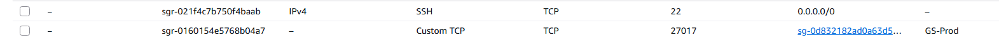
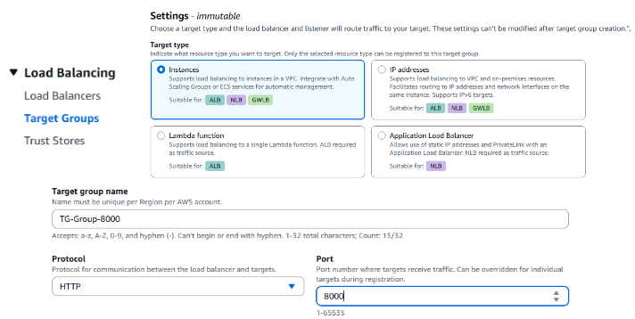
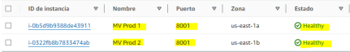
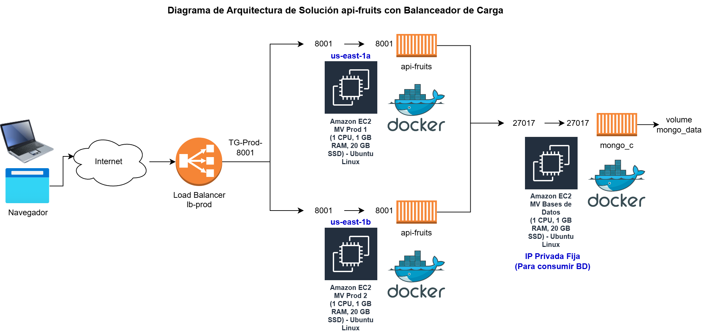

<!-- _class: portada -->

# CS2032 - Cloud Computing

Balanceo de Carga y Alta disponibilidad
Semana 6 - Taller 4: Balanceador de Carga

---

## Contenido

1. Objetivo del taller
2. Ejercicio 1: Crear contenedor de MongoDB en MV Bases de datos
3. Ejercicio 2: Crear contenedor de api-fruits con acceso a MongoDB en MV Desarrollo
4. Ejercicio 3: Desplegar contenedor api-fruits en 2 MV de producción
5. Ejercicio 4: Configurar y probar Balanceador de Carga
6. Ejercicio 5: Diagrama de Arquitectura de Solución
7. Cierre

---

<!-- _class: objetivo -->

## Objetivo del taller: Balanceador de Carga

> Probar Balanceo de Carga y Alta disponibilidad con Api REST con acceso a base de datos **MongoDB** (NoSQL)

---

<!-- _class: seccion -->

## 01

### Ejercicio 1: Crear contenedor de MongoDB en MV Bases de datos

---

## Ejercicio 1: Crear contenedor de MongoDB en MV Bases de datos

- **Paso 1:** Ingrese a la máquina virtual "MV Bases de datos"
- **Paso 2:** Ejecute el contenedor de MongoDB y verifique el volumen y los logs:

```bash
$ docker run -d --rm --name mongo_c -p 27017:27017 \
  -v mongo_data:/data/db mongo:latest
$ docker volume ls
$ docker logs mongo_c
```

- **Paso 3:** Dado que MongoDB se ejecuta **sin usuario y password**, sólo debe ser accedido por máquinas de la red local (privada). En el grupo de seguridad de "MV Bases de datos" abra el puerto **27017** para:
  - El mismo grupo de seguridad
  - El grupo de seguridad de MV Desarrollo y MV Pruebas
  - El grupo de seguridad de producción **"GS-Prod"**

---

## Ejercicio 1: Crear contenedor de MongoDB en MV Bases de datos

Configuración de reglas de entrada en el grupo de seguridad:



---

## Ejercicio 1: Crear contenedor de MongoDB en MV Bases de datos

- **Paso 4:** Conectarse al linux del contenedor y mongo:

```bash
docker exec -it mongo_c bash
mongosh
```

- **Paso 5:** Crear base de datos `food`, colección `fruits`, insertar datos y salir:

```bash
use food
db.createCollection("fruits")
db.fruits.insertMany([
  {name: "apple",  origin: "usa",      price: 5},
  {name: "orange", origin: "italy",    price: 3},
  {name: "mango",  origin: "malaysia", price: 3}
])
db.fruits.find().pretty()
exit
exit
```

---

<!-- _class: seccion -->

## 02

### Ejercicio 2: Crear contenedor de api-fruits con acceso a MongoDB en MV Desarrollo

---

## Ejercicio 2: Crear contenedor de api-fruits con acceso a MongoDB en MV Desarrollo

- **Paso 1:** Cree un repo `api-fruits` en GitHub y suba los archivos indicados por el docente. Luego ingrese a "MV Desarrollo" y descargue el repo con `git clone`.

- **Paso 2:** Analice el `Dockerfile` y `app.py`. En `app.py` reemplace por la **IP privada fija** de su "MV Bases de datos":

```python
class MongoAPI:
    def __init__(self, data):
        self.client = MongoClient("mongodb://172.31.92.214:27017")
        # ^ Reemplace por IP privada de MV Base de Datos
```

- **Paso 3:** Cree la imagen:

```bash
docker build -t api-fruits .
```

<div class="footer-text">
Referencia del api-fruits: <a href="https://ishmeet1995.medium.com/how-to-create-restful-crud-api-with-python-flask-mongodb-and-docker-8f6rcb73c5bc">medium.com</a>
</div>

---

## Ejercicio 2: Crear contenedor de api-fruits con acceso a MongoDB en MV Desarrollo

- **Paso 4:** Suba la imagen a [hub.docker.com](https://hub.docker.com):

```bash
docker login -u gcolchado
docker tag api-fruits gcolchado/api-fruits
docker push gcolchado/api-fruits
docker logout
```

> Reemplace `gcolchado` por su usuario de Docker Hub

---

## Ejercicio 2: Crear contenedor de api-fruits con acceso a MongoDB en MV Desarrollo

- **Paso 5:** Ejecute el contenedor y verifique logs:

```bash
docker run -d --rm --name api-fruits_c -p 8001:8001 api-fruits
docker logs api-fruits_c
```

- **Paso 6:** Abra el puerto **8001** en el grupo de seguridad de "MV Desarrollo"

- **Paso 7:** Pruebe en Postman el api-fruits con la IP de "MV Desarrollo"

---

## Ejercicio 2: Crear contenedor de api-fruits con acceso a MongoDB en MV Desarrollo

Ejemplos de prueba en Postman — **Consultar** y **Crear** frutas:

| Operación | Método | URL | Body (JSON) |
|---|---|---|---|
| Consultar frutas | GET | `http://<MV-Desarrollo>:8001/mongodb` | `{"database":"food","collection":"fruits"}` |
| Crear fruta | POST | `http://<MV-Desarrollo>:8001/mongodb` | `{"database":"food","collection":"fruits","Document":{"name":"pear","origin":"usa","price":10}}` |

<!-- TODO: agregar capturas de pantalla de Postman - consultar y crear fruta -->

---

## Ejercicio 2: Crear contenedor de api-fruits con acceso a MongoDB en MV Desarrollo

Ejemplos de prueba en Postman — **Modificar** y **Eliminar** frutas:

| Operación | Método | URL | Body (JSON) |
|---|---|---|---|
| Modificar fruta | PUT | `http://<MV-Desarrollo>:8001/mongodb` | `{"database":"food","collection":"fruits","Filter":{"name":"pear"},"DataToBeUpdated":{"origin":"peru","price":11.5}}` |
| Eliminar fruta | DELETE | `http://<MV-Desarrollo>:8001/mongodb` | `{"database":"food","collection":"fruits","Filter":{"name":"pear"}}` |

<!-- TODO: agregar capturas de pantalla de Postman - modificar y eliminar fruta -->

---

<!-- _class: seccion -->

## 03

### Ejercicio 3: Desplegar contenedor api-fruits en 2 MV de producción

---

## Ejercicio 3: Desplegar contenedor api-fruits en 2 MV de producción

**Paso 1:** Ingrese y ejecute el contenedor en las **2 MV de producción** y verifique los logs de ejecución:

```bash
$ docker run -d --rm --name api-fruits_c -p 8001:8001 gcolchado/api-fruits
$ docker logs api-fruits_c
```

> Ejecute estos comandos tanto en **MV Prod 1** como en **MV Prod 2** de forma independiente

---

<!-- _class: seccion -->

## 04

### Ejercicio 4: Configurar y probar Balanceador de Carga

---

## Ejercicio 4: Configurar y probar Balanceador de Carga

- **Paso 1:** En grupo de seguridad **"GS-Prod"**, que usan las 2 MV de producción, abra el puerto **8001**

- **Paso 2:** Crear un **Target Group** con las 2 MV de producción para el puerto 8001:



---

## Ejercicio 4: Configurar y probar Balanceador de Carga

**Paso 3:** Agregue un agente de escucha en el Balanceador de Carga (`lb-prod`):


---

## Ejercicio 4: Configurar y probar Balanceador de Carga

**Paso 4:** Verifique que estén **"Healthy"** las 2 MV de producción y pruebe en Postman con el enlace del balanceador de carga varias veces:



**Pruebas de Alta Disponibilidad:**

- **Paso 5:** Detener la instancia "MV Prod 1" y probar
- **Paso 6:** Detener la instancia "MV Prod 2" y probar
- **Paso 7:** Iniciar "MV Prod 1", ejecutar el contenedor y probar:
  `$ docker run -d --rm --name api-fruits_c -p 8001:8001 gcolchado/api-fruits`
- **Paso 8:** Iniciar "MV Prod 2", ejecutar el contenedor y probar:
  `$ docker run -d --rm --name api-fruits_c -p 8001:8001 gcolchado/api-fruits`

---

<!-- _class: seccion -->

## 05

### Ejercicio 5: Diagrama de Arquitectura de Solución

---

## Ejercicio 5: Diagrama de Arquitectura de Solución

**Diagrama de Arquitectura de Solución api-fruits con Balanceador de Carga**



---

<!-- _class: seccion -->

## 06

### Cierre

---

<!-- _class: objetivo -->

## Cierre: ¿Qué aprendimos?

> Balanceo de Carga y Alta disponibilidad con **Api REST** con acceso a base de datos **MongoDB** (NoSQL)

---

<!-- _class: cierre -->

# ¡Gracias!

---

<!-- _class: cierre -->


